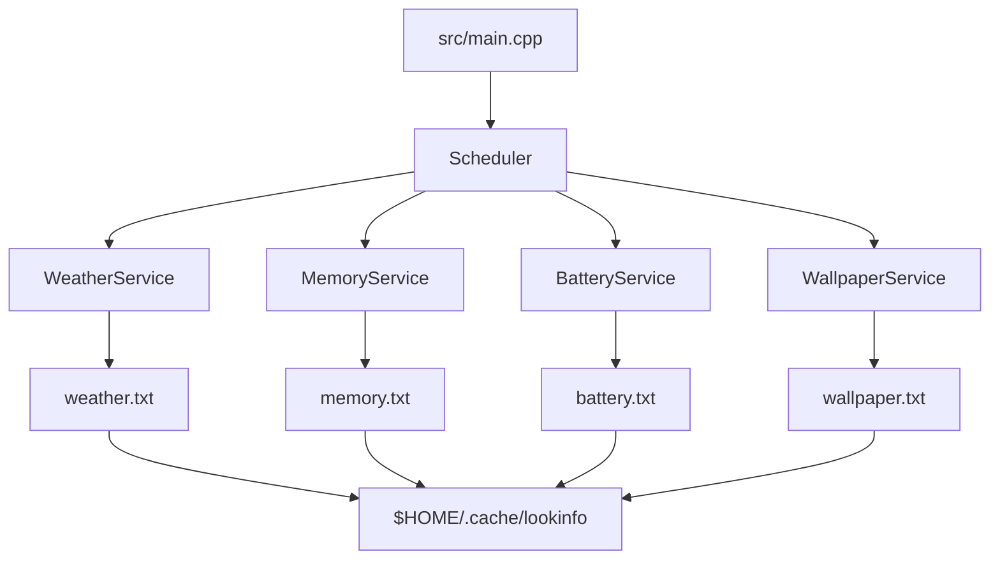
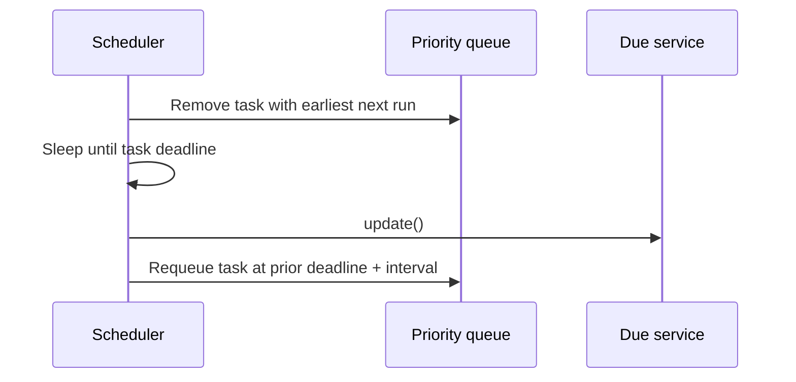

# LookInfo

[](#testing)
[](#license)
[](#build-instructions)

LookInfo is an experimental Linux information collector written in C++20. It runs in the foreground, periodically gathers selected local and network data, and writes human-readable values to files in a per-user cache directory. Desktop components and scripts can read those files instead of duplicating polling and parsing logic.

The project is under active development. It does not yet provide a configuration file, automated test suite, service-manager integration, graceful shutdown, or a stable cache schema.

## Overview

LookInfo currently collects weather, memory, battery, and wallpaper-path information. Each collector is represented by a service and is scheduled independently by a priority-queue scheduler. Services publish their latest value to files under `$HOME/.cache/lookinfo`.

The current executable uses fixed runtime values, including a weather location, a wallpaper directory, and a battery sysfs path. See [Configuration](#configuration) before running it.

## Motivation

Desktop widgets often repeat the same work: polling a weather API, reading `/proc` or `/sys`, maintaining timers, and formatting data. LookInfo explores a different boundary: collect data once in a small Linux process, then let presentation tools consume the latest cached value.

This separates data collection from presentation. It is intended to make integrations with tools such as Waybar, Hyprlock, Eww, and shell scripts simpler without coupling LookInfo to any one desktop environment.

## Features

Implemented today:

- C++20 executable built with CMake.
- Priority-queue scheduling based on `std::chrono::steady_clock`.
- Weather retrieval from the Open-Meteo API.
- Memory usage collection from `/proc/meminfo`.
- Battery status collection from a fixed Linux sysfs path.
- Random wallpaper-path selection from a fixed local directory.
- File-based cache output under `$HOME/.cache/lookinfo`.

Current limitations:

- Runtime settings are compiled into `src/main.cpp`.
- The quote service exists in the source tree but is not scheduled by the executable.
- The process runs indefinitely in the foreground and has no graceful signal handling.
- Cache files are plain presentation text, not a versioned machine-readable API.
- The project has no active automated test suite.

## Architecture Overview



The scheduler receives service objects and intervals. It waits until the next due task, calls `update()`, then requeues that task for a later run. Services are responsible for gathering their own data and writing their own cache output.

## Project Structure

```text
.
├── CMakeLists.txt                 Build definition
├── README.md
├── data/
│   └── quotes.txt                 Quote data used by QuoteService
├── include/
│   ├── IService.hpp               Common service interface
│   ├── scheduler.hpp              Priority-queue scheduler
│   ├── weather.hpp
│   ├── batteryService.hpp
│   ├── memoryService.hpp
│   ├── quoteService.hpp
│   ├── wallpaper.hpp
│   ├── fileHandler.hpp            Cache-file writing helper
│   └── pathFinder.hpp             Cache-directory helper
├── src/
│   ├── main.cpp                   Current application composition
│   ├── scheduler.cpp
│   ├── weather.cpp
│   ├── batteryService.cpp
│   ├── memoryService.cpp
│   ├── quoteService.cpp
│   ├── wallpaper.cpp
│   ├── fileHandler.cpp
│   └── pathFinder.cpp
└── trash/                         Historical experiments; not built or supported
```

## Installation

There are currently no release packages or installation rules. Build from a clone of this repository.

Requirements:

- Linux environment with `/proc` and `/sys`.
- CMake 3.20 or newer.
- A C++20-capable compiler.
- libcurl development files discoverable by CMake.
- nlohmann/json headers available to the compiler.

Package names vary by distribution. For example, Debian/Ubuntu users will typically need development packages for libcurl and nlohmann/json in addition to CMake and a C++ compiler.

## Build Instructions

```bash
git clone https://github.com/KagE-Akumaa/lookinfo.git
cd lookinfo

cmake -S . -B build
cmake --build build
```

The build produces `build/lookinfo`.

## Configuration

LookInfo does not currently have a configuration file or command-line configuration. The following values are fixed in `src/main.cpp` and related service implementations:

| Setting | Current value | Notes |
| --- | --- | --- |
| Weather location | `31.1044, 77.1666` | Used to construct the Open-Meteo URL. |
| Weather interval | 120 seconds | The README does not promise API availability or freshness. |
| Memory interval | 30 seconds | Reads `/proc/meminfo`. |
| Battery interval | 60 seconds | Reads `/sys/class/power_supply/BAT1/uevent`. |
| Wallpaper interval | 3 seconds | Recursively scans the wallpaper directory on each update. |
| Wallpaper directory | `/home/akumaa/Wallpapers` | Change this source value before building if it does not exist on your system. |
| Cache directory | `$HOME/.cache/lookinfo` | `XDG_CACHE_HOME` is not currently honored. |

The quote service currently uses `../data/quotes.txt` relative to the process working directory, but it is not registered with the scheduler.

## Usage Examples

Start LookInfo from the repository root after building:

```bash
./build/lookinfo
```

The process continues running until it is terminated externally. It has no built-in graceful shutdown support yet.

Inspect currently written cache files from another terminal:

```bash
cat "$HOME/.cache/lookinfo/memory.txt"
cat "$HOME/.cache/lookinfo/battery.txt"
cat "$HOME/.cache/lookinfo/weather.txt"
cat "$HOME/.cache/lookinfo/wallpaper.txt"
```

A shell consumer can read a value directly:

```bash
printf 'Memory: %s\n' "$(cat "$HOME/.cache/lookinfo/memory.txt")"
```

Consumers should tolerate missing files and temporarily unavailable data. Cache-file contents are not yet a stable API.

## Example Output

Output is formatted for display and can vary with the system and weather response. The current implementation prefixes memory, battery, and weather values with Unicode icons; `[icon]` below denotes that prefix without embedding it in the documentation.

```text
# memory.txt
[memory icon] 5.3G / 15.4G

# battery.txt
[battery icon] 84% Discharging

# weather.txt
[weather icon] 18.4°C | ↑22.0° ↓12.1°

# wallpaper.txt
/home/example/Wallpapers/forest.jpg
```

The presentation strings are not a stable long-term API.

## Supported Modules

| Module | Source | Scheduled by default | Output |
| --- | --- | --- | --- |
| WeatherService | Open-Meteo HTTP API | Yes, every 120 seconds | `weather.txt` |
| MemoryService | `/proc/meminfo` | Yes, every 30 seconds | `memory.txt` |
| BatteryService | `/sys/class/power_supply/BAT1/uevent` | Yes, every 60 seconds | `battery.txt` |
| WallpaperService | Fixed local wallpaper directory | Yes, every 3 seconds | `wallpaper.txt` |
| QuoteService | `../data/quotes.txt` | No | `quotes.txt` when invoked |

Battery support is currently limited to systems exposing a `BAT1` device. Wallpaper selection recognizes `.jpg`, `.jpeg`, and `.png` extensions.

## Scheduler Overview



The scheduler uses `std::chrono::steady_clock`, which is appropriate for measuring elapsed time because wall-clock adjustments do not move its time points. Updates execute synchronously on one scheduler thread; a slow service can therefore delay others.

## Cache Format

The cache directory is created as:

```text
$HOME/.cache/lookinfo/
```

Each active service writes a single text file. Values are human-readable strings intended for desktop display, not structured records. There is currently no schema version, timestamp, freshness marker, or atomic-publication guarantee.

| File | Current content |
| --- | --- |
| `weather.txt` | Current, maximum, and minimum temperatures formatted as text. |
| `memory.txt` | Used and total memory in GiB formatted as text. |
| `battery.txt` | Battery percentage and status formatted as text. |
| `wallpaper.txt` | Absolute path of a selected image. |
| `quotes.txt` | Random quote text if QuoteService is invoked; not produced by the default scheduler. |

## Development

The current composition root is `src/main.cpp`. It constructs services, selects output paths, and registers scheduled work. `IService` defines the common `update()` interface; `Scheduler` determines when updates are called.

When investigating or extending the implementation, start with:

1. `include/IService.hpp` for the service interface.
2. `src/scheduler.cpp` for current scheduling behavior.
3. `src/main.cpp` for active service registration and hard-coded runtime values.
4. Individual service headers and sources for collection and formatting logic.

Adding a module is not yet documented as a stable extension API. In the current design, a new service needs to implement `IService`, write an output value, and be registered in `src/main.cpp` with an interval. Please open or discuss an issue before introducing a new module so the configuration, error-handling, and cache-format implications can be considered.

## Testing

There is no supported automated test suite or CTest target at present. The `trash/` directory contains historical experimental files and is not part of the build or test process.

Before submitting changes, at minimum perform a clean CMake configure and build:

```bash
cmake -S . -B build
cmake --build build
```

Automated unit and integration testing is planned.

## Contributing

Contributions are welcome, especially around correctness, portability, testing, configuration, and documentation. The repository does not yet have a formal contribution guide.

For now:

1. Open an issue or comment on an existing issue before substantial changes.
2. Keep changes focused on one concern.
3. Build the project with the documented CMake commands.
4. Explain tested environments and any Linux-specific assumptions in the pull request.
5. Do not treat files in `trash/` as supported implementation or test code.

## Roadmap

Planned work includes:

- Typed runtime configuration.
- Robust cache publication and a documented cache schema.
- Graceful shutdown and operational logging.
- Automated unit and integration tests.
- CMake installation support and reproducible dependency declarations.
- Improved battery discovery and portable resource paths.
- Optional IPC and plugin exploration after the core runtime is reliable.

See the [issue tracker](https://github.com/KagE-Akumaa/lookinfo/issues) for current work items.

## License

No license has been added to this repository yet. Until a license is provided, reuse, redistribution, and contribution terms are not defined. A license is required before the project can be considered ready for broad open-source adoption.
